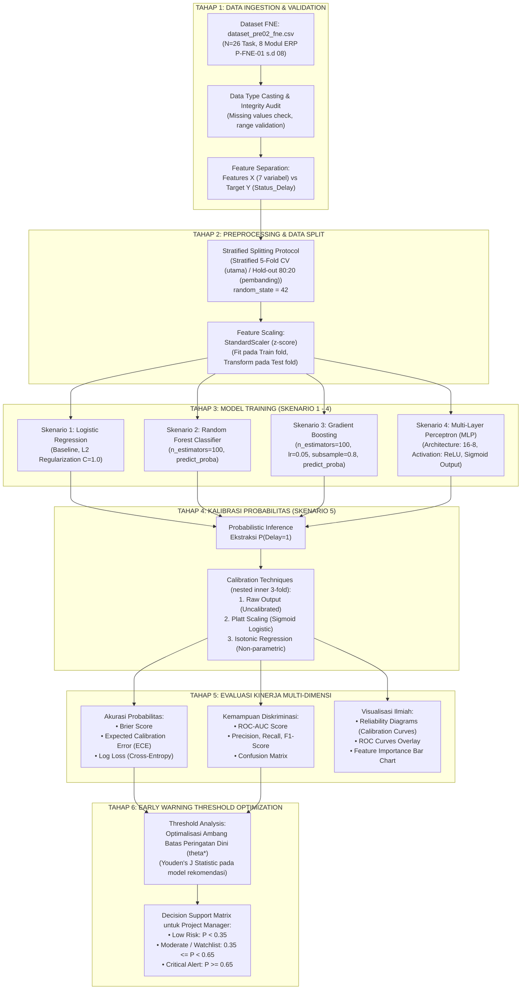

# DOKUMEN IMPLEMENTASI DESAIN EKSPERIMEN (PERTEMUAN 4)
## Topik Riset: PRE-02 — Prediksi Probabilitas Keterlambatan Proyek Multi Sumber Daya Terbatas
**Studi Kasus:** Portofolio Modul Super ERP Farm Nation Enterprise (FNE) 2026  
**Penanggung Jawab:** Lead Author & Tim Peneliti PRE-02  
**Tanggal Penyusunan:** September 2026  

---

## 1. Executive Summary: Kebutuhan Pertemuan 4

Sesuai silabus perkuliahan pada `progres_penelitian_MP.md`, capaian utama **Pertemuan 4 (Implementasi Desain Eksperimen)** difokuskan pada:
1. **Penerapan Metode:** Mengoperasionalkan model *Machine Learning* probabilistik yang tidak sekadar mengklasifikasikan keterlambatan secara biner, melainkan mengestimasi nilai probabilitas kontinu $P(\text{Delay} = 1) \in [0.0, 1.0]$.
2. **Penyusunan Skenario Eksperimen:** Menyusun 5 skenario eksperimen bertingkat (Logistic Regression, Random Forest, Gradient Boosting, MLP Neural Network, dan Analisis Kalibrasi).
3. **Penentuan Parameter & Variabel Kontrol:** Mengunci variabel independen ($X_1 \dots X_7$), variabel target ($Y$), *hyperparameter* masing-masing algoritma, serta protokol replikasi (*fixed random seed*, *cross-validation*).
4. **Deliverables:** Dokumen alur flow eksperimen, script/tools komputasi Python, dan naskah draf metodologi Bab III.

---

## 2. Flowchart Alur Eksperimen (End-to-End ML Pipeline)

Alur eksperimen dirancang mengikuti metodologi saintifik standar CRISP-DM (*Cross-Industry Standard Process for Data Mining*) yang diadaptasi khusus untuk pemantauan proyek perangkat lunak prediktif (*Predictive Project Monitoring*).

---

## 3. Rincian Skenario Eksperimen (Skenario 1 s.d 5)

Sesuai arahan pada `Deskripsi_Penelitian.md`, eksperimen dirancang secara komparatif melalui 5 skenario:

### 3.1. Skenario 1 — Model Baseline: Logistic Regression
- **Tujuan:** Membangun model pembanding dasar (*baseline*) yang secara matematis menghasilkan estimasi probabilitas terkalibrasi secara alami melalui fungsi sigmoid:
  $$P(Y=1|X) = \frac{1}{1 + e^{-(\beta_0 + \sum \beta_i X_i)}}$$
- **Karakteristik:** Linier, transparan, koefisien dapat diinterpretasikan secara langsung sebagai *log-odds*.
- **Parameter Utama:** `penalty='l2'`, `C=1.0`, `max_iter=1000`, `random_state=42`.
- **Implementasi:** Fungsi objektif konveks (log-loss + penalti L2) diselesaikan hingga konvergen dengan Newton-Raphson pada `experiment_pipeline.py`; karena optimumnya unik, solusinya setara dengan solver `lbfgs` scikit-learn (selisih probabilitas terverifikasi ≤ 0.0002).

### 3.2. Skenario 2 — Ensemble Tree: Random Forest (`predict_proba`)
- **Tujuan:** Menangkap interaksi non-linier dan mengurangi varians prediksi dengan menggabungkan *decision trees*.
- **Estimasi Probabilitas:** Dihitung dari rata-rata proporsi kelas delay pada daun (*leaf*) tiap pohon keputusan (setara `RandomForestClassifier.predict_proba`):
  $$P(Y=1|X) = \frac{1}{B} \sum_{b=1}^{B} P_b(Y=1|X)$$
- **Parameter Utama:** `n_estimators=100`, `max_depth=3`, `min_samples_split=2`, `max_features='sqrt'`, `criterion='gini'`, `random_state=42`.
- **Output Tambahan:** *MDI Feature Importance* untuk mengidentifikasi pemicu keterlambatan utama.

### 3.3. Skenario 3 — Boosting: Gradient Boosting (`predict_proba`)
- **Tujuan:** Mengoptimalkan fungsi loss diferensiabel (*deviance / log-loss*) secara sekuensial guna meminimalkan bias residual.
- **Karakteristik:** Cenderung menghasilkan pemisahan batas keputusan yang sangat tajam (*high discriminatory power*).
- **Parameter Utama:** `learning_rate=0.05`, `n_estimators=100`, `max_depth=2`, `subsample=0.8`, `random_state=42`.
- **Implementasi:** Pohon regresi (kriteria reduksi SSE) dilatih pada pseudo-residual $y - \hat{p}$; nilai daun menggunakan langkah Newton Friedman (2001) $\gamma = \sum r_i / \sum \hat{p}_i(1-\hat{p}_i)$.

### 3.4. Skenario 4 — Arsitektur Jaringan: Multi-Layer Perceptron (MLP)
- **Tujuan:** Menangkap pemetaan fitur non-linier berdimensi tinggi melalui arsitektur jaringan saraf tiruan lapis tersembunyi dengan fungsi aktivasi output *logistic sigmoid*.
- **Arsitektur Jaringan:**
  - *Input Layer:* 7 neuron ($X_1 \dots X_7$)
  - *Hidden Layer 1:* 16 neuron (Aktivasi: ReLU)
  - *Hidden Layer 2:* 8 neuron (Aktivasi: ReLU)
  - *Output Layer:* 1 neuron (Aktivasi: Logistic Sigmoid)
- **Parameter Utama:** `hidden_layer_sizes=(16, 8)`, `activation='relu'`, `solver='adam'`, `alpha=0.01` (L2 regularization), `learning_rate_init=0.01`, `max_iter=1000`, `random_state=42`.

### 3.5. Skenario 5 — Analisis & Optimasi Kalibrasi Probabilitas
- **Tujuan:** Menguji dan mengoreksi distorsi probabilitas (mengatasi kecenderungan *overconfidence* atau *underconfidence* pada model pohon dan neural network).
- **Metode Kalibrasi:**
  1. *Platt Scaling (Sigmoid Calibration):* Melatih model regresi logistik univariat pada output logits model.
  2. *Isotonic Regression:* Transformasi non-parametrik monotonik naik.
- **Protokol Tanpa Kebocoran Data:** Di dalam setiap fold training, prediksi *out-of-fold* diperoleh melalui *inner stratified 3-fold*; kalibrator dilatih pada prediksi tersebut, kemudian model dasar dilatih ulang pada seluruh fold training dan kalibrator diterapkan pada fold uji.
- **Evaluasi Kalibrasi:** Analisis *Reliability Diagram* (5 *equal-width bins*; dengan $N = 26$, 10 bin menyisakan terlalu banyak bin kosong/berisi 1 sampel) dan perhitungan *Expected Calibration Error* (ECE).
- **Luaran:** Rekomendasi model dengan kalibrasi terbaik, yaitu kombinasi model × metode kalibrasi dengan Brier Score terendah (tie-break: ECE, lalu Log Loss), sesuai Eksperimen Kelima pada `Deskripsi_Penelitian.md`.

---

## 4. Penentuan Variabel Kontrol & Matriks Hyperparameter

### 4.1. Variabel Penelitian (Input $X$ vs Target $Y$)

| Simbol | Nama Fitur | Tipe Data | Definisi Operasional | Rationale / Relevansi PRE-02 |
| :---: | :--- | :---: | :--- | :--- |
| $X_1$ | `Planned_Duration_Days` | Numerik | Estimasi durasi pengerjaan aktivitas (hari) | Skala waktu pengerjaan tugas |
| $X_2$ | `Planned_Effort_Hours` | Numerik | Beban jam kerja orang (*person-hours*) yang direncanakan | Skala kompleksitas sumber daya manusia |
| $X_3$ | `Predecessor_Count` | Diskrit | Jumlah aktivitas prasyarat langsung yang harus selesai sebelum modul ini | Merepresentasikan keterikatan dependensi antar-modul (*Inter-module dependency*) |
| $X_4$ | `Resource_Utilization_Rate` | Rasio | Rasio alokasi jam kerja terhadap kapasitas developer ($>1.0$ berarti overload) | Mengukur keterbatasan sumber daya bersama (*shared developer constraints*) |
| $X_5$ | `Risk_Score` | Rasio ($0-1$) | Indeks risiko inheren modul berdasarkan evaluasi Risk Matrix PMP | Menangkap potensi ancaman teknis bawaan |
| $X_6$ | `SPI_Value` | Rasio | *Schedule Performance Index* ($EV / PV$) pada titik monitoring | Metrik pemantauan kinerja jadwal klasik (PMBOK EVM) |
| $X_7$ | `Change_Request_Count` | Diskrit | Frekuensi usulan perubahan lingkup (*scope changes*) yang diajukan | Ketidakstabilan kebutuhan (*requirement churn*) |
| $Y$ | `Status_Delay` | Biner ($0/1$) | Kondisi aktual keterlambatan ($1 = \text{Terlambat}, 0 = \text{Tepat Waktu}$) | Label acuan probabilitas $P(Y=1)$ |

### 4.2. Protokol Kontrol Eksperimen (Replication Standards)

Untuk menjamin asas keterulangan ilmiah (*reproducibility*) dan mencegah kebocoran data (*data leakage*):
1. **Random Seed:** Seluruh komponen stokastik dikunci pada `random_state = 42`.
2. **Data Partitioning Protocol:**
   - Karena dataset $N = 26$, strategi evaluasi utama menggunakan **Stratified 5-Fold Cross-Validation** (memastikan rasio kelas 16 Delay : 10 On-Time proporsional pada tiap fold).
   - Sebagai pembanding operasional, dijalankan pula **Hold-out Train-Test Split (80% : 20%)** dengan stratifikasi (21 : 5 task). Karena data uji hanya 5 task, hasilnya bersifat indikatif dan tidak dipakai untuk pemilihan model.
3. **Penskalaan Fitur Terisolasi:**
   - Penskalaan fitur numerik menggunakan `StandardScaler` ($\mu=0, \sigma=1$).
   - Penskalaan dihitung (*fit*) HANYA pada data training tiap fold, kemudian diterapkan (*transform*) pada data testing untuk mencegah kebocoran informasi masa depan (*data snooping*).

### 4.3. Matriks Hyperparameter Model

| Model | Hyperparameter | Nilai yang Ditetapkan | Justifikasi Ilmiah |
| :--- | :--- | :--- | :--- |
| **Logistic Regression** | `penalty` `C` `solver` `max_iter` | `'l2'` `1.0` `Newton-Raphson` (setara `'lbfgs'`) `1000` | Mencegah overfitting pada sampel terbatas; objektif konveks menjamin konvergensi ke optimum global. |
| **Random Forest** | `n_estimators` `max_depth` `min_samples_split` `criterion` | `100` `3` `2` `'gini'` | Pohon dibatasi kedalamannya agar tidak memorisasi data berukuran $N=26$. |
| **Gradient Boosting** | `n_estimators` `learning_rate` `max_depth` `subsample` | `100` `0.05` `2` `0.8` | *Conservative shrinkage rate* (0.05) dengan subsampling untuk regularisasi stokastik. |
| **MLP Neural Net** | `hidden_layer_sizes` `activation` `alpha` `solver` | `(16, 8)` `'relu'` `0.01` `'adam'` | Arsitektur piramida kecil yang mencegah ledakan parameter pada dataset tabular. |

---

## 5. Metrik Evaluasi Kinerja Eksperimen

Pengujian performa model dinilai melalui 2 dimensi saling melengkapi:

### 5.1. Dimensi Kalibrasi Probabilitas (Kualitas Probabilitas)
1. **Brier Score (BS):**
   $$BS = \frac{1}{N} \sum_{i=1}^{N} (p_i - y_i)^2$$
   *Rentang nilai:* $0 \le BS \le 1$. Nilai mendekati 0 menunjukkan estimasi probabilitas yang semakin sempurna.
2. **Log Loss (Cross-Entropy):**
   $$\text{LogLoss} = -\frac{1}{N} \sum_{i=1}^{N} [y_i \ln(p_i) + (1 - y_i) \ln(1 - p_i)]$$
   Menghukum sangat keras prediksi probabilitas yang sangat yakin tetapi salah (*overconfident error*).
3. **Expected Calibration Error (ECE):**
   $$ECE = \sum_{m=1}^{M} \frac{|B_m|}{N} |\text{acc}(B_m) - \text{conf}(B_m)|$$
   Mengukur rata-rata selisih absolut antara akurasi empiris dan tingkat keyakinan model (*confidence*) pada tiap bin interval probabilitas.

### 5.2. Dimensi Diskriminasi Klasifikasi (Pemisahan Kelas)
1. **Area Under ROC Curve (ROC-AUC):** Mengukur kemampuan model membedakan modul terlambat vs tepat waktu pada seluruh ambang batas.
2. **Sensitivity (Recall) & Specificity:** Mengukur tingkat ketepatan deteksi keterlambatan aktual dan pencegahan alarm palsu.
3. **F1-Score:** Rata-rata harmonis antara precision dan recall.

---

## 6. Integrasi Sistem Peringatan Dini (Early Warning Thresholding)

Nilai probabilitas keluaran model $P(\text{Delay} = 1)$ ditranslasikan menjadi kebijakan mitigasi risiko melalui penetapan ambang batas peringatan (*Alert Threshold* $\theta^*$):

$$\text{Action}(P) = \begin{cases} 
\text{Status HIJAU (Normal / Low Risk)}, & P < 0.35 \\
\text{Status KUNING (Watchlist / Medium Risk)}, & 0.35 \le P < 0.65 \\
\text{Status MERAH (Critical Alert / High Risk)}, & P \ge 0.65 
\end{cases}$$

- **Status Hijau:** Monitoring rutin berkala, tidak perlu alokasi sumber daya tambahan.
- **Status Kuning:** Project Manager melakukan rapat koordinasi dengan *module lead*, evaluasi ketergantungan task pendahulu, dan penguncian *scope change*.
- **Status Merah:** *Fast-tracking* atau *crashing*, penambahan bantuan developer dari modul foundation/stabil, serta eskalasi ke *Steering Committee*.
