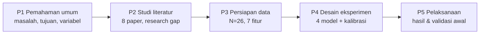

# Panduan Presentasi PRE-02: Progres Pertemuan 1–5

22 September 2026 · Mukti Baskara

Panduan ini untuk presenter yang akan menyampaikan progres pertemuan 1 sampai 5 sekaligus: bagian atas untuk memahami isi, bagian bawah untuk naskah bicara dan persiapan tanya-jawab.

## Gambaran besar

PRE-02 membangun model machine learning yang memberi **probabilitas 0–1** bahwa sebuah task proyek akan terlambat, lalu memakai probabilitas itu sebagai **early warning system** (zona Hijau/Kuning/Merah) bagi Project Manager. Studi kasusnya 26 task dari 8 sub-proyek Super ERP Farm Nation Enterprise (FNE) 2026.

Kalimat pembuka yang bisa dihafal: *"Kami tidak sekadar menebak terlambat atau tidak, tapi menghitung seberapa besar peluangnya, dan memastikan angka peluang itu bisa dipercaya."*

Setiap pertemuan menjawab satu pertanyaan: *apa masalahnya* (P1), *apa yang sudah diteliti orang dan celahnya* (P2), *datanya apa* (P3), *bagaimana cara mengujinya* (P4), *hasilnya apa* (P5).

Tim: Mukti Baskara (lead author, narasi dan literatur), Muhammad Nailul (data dan eksperimen), Rafiq.

## Pertemuan 1 — Pemahaman umum

Intinya: klasifikasi risiko Low/Medium/High terlalu kasar, jadi PM butuh angka peluang terlambat yang bisa dipercaya untuk bertindak lebih awal. Sumber: `PRE02_Pertemuan1_Pemahaman_Umum.pptx`.

- **Latar belakang:** FNE punya 8 sub-proyek terintegrasi (P-FNE-01 s.d. P-FNE-08) yang berbagi sumber daya terbatas, terutama developer.
- **Masalah:** label risiko kualitatif tidak memberi ambang tindakan yang jelas.
- **Tujuan:** (1) model supervised learning yang memprediksi probabilitas keterlambatan pada fase monitoring & evaluation; (2) early warning system berbasis ambang probabilitas.
- **Manfaat praktis:** PM bisa memprioritaskan task berisiko dan memulihkan jadwal lebih cepat.
- **Manfaat akademis:** kerangka predictive monitoring probabilistik, dievaluasi dengan Brier Score, Log Loss, dan calibration curve.
- **Batasan:** hanya fase monitoring & evaluation; data dari dokumen PMP dan SRS FNE; 4 algoritma (Logistic Regression, Random Forest, Gradient Boosting, Neural Network).
- **Variabel terikat:** P(Delay), nilai 0 (aman) sampai 1 (kritis).

Variabel bebas di P1 masih konseptual. Di P3 diterjemahkan jadi kolom dataset, dan pemetaannya tidak satu-satu. Presenter perlu siap menjelaskan ini:

| Variabel P1 | Kolom dataset P3 | Catatan |
| --- | --- | --- |
| Progres aktual vs rencana | `SPI_Value` | SPI = EV/PV |
| Tingkat utilisasi sumber daya | `Resource_Utilization_Rate` | >1.0 berarti overload |
| Risiko belum dimitigasi | `Risk_Score` | indeks P × I, 0–1 |
| Frekuensi perubahan | `Change_Request_Count` | jumlah change request |
| Kinerja dependency | `Predecessor_Count` | jumlah pendahulu, bukan status keterlambatannya |
| Sisa waktu hingga deadline | — | tidak ada; diganti `Planned_Duration_Days` |
| Backlog tersisa | — | tidak ada; diganti `Planned_Effort_Hours` |

Ambang contoh di P1 adalah P = 0.70; di P4 ambang zona Merah ditetapkan 0.65.

## Pertemuan 2 — Studi literatur dan research gap

Intinya: penelitian terdahulu memprediksi keterlambatan sebagai label atau durasi, jarang menguji apakah probabilitasnya terkalibrasi, dan jarang memodelkan sumber daya bersama antar-proyek. Itu celah yang diisi PRE-02.

Output yang sudah ada:

- [[Pertemuan2_Matriks_Literatur]]: matriks 8 paper inti (EVM, ML untuk delay, penjadwalan multi-proyek, kalibrasi, early warning).
- [[Tinjauan Pustaka]] (folder `02_Studi Literatur`): tabel 28 referensi (20 dari penelusuran Mukti, 8 dari matriks Nailul), sudah dicek judul dan venue-nya.
- [[Pertemuan2_Draft_Tinjauan_Pustaka]]: draft Bab II (multi-proyek, EVM, ML, teori kalibrasi, EWS, research gap).

Paper yang paling layak disebut saat presentasi:

| Paper | Kenapa penting untuk PRE-02 |
| --- | --- |
| Batselier & Vanhoucke (2015) | Dasar SPI/EVM sebagai fitur; tapi hasilnya deterministik |
| Wauters & Vanhoucke (2016) | ML mengalahkan EVM untuk forecasting durasi; tapi outputnya durasi, bukan probabilitas |
| Gondia et al. (2020) | ML untuk risiko delay konstruksi; outputnya kelas diskrit |
| Browning & Yassine (2010) | Landasan penjadwalan multi-proyek dengan sumber daya terbatas |
| Niculescu-Mizil & Caruana (2005) | Dasar Platt Scaling, Isotonic Regression, dan Brier Score |
| Guo et al. (2017) | Dasar ECE dan risiko neural network yang overconfident |

Research gap, dalam bahasa lisan:

1. **Output kaku:** kebanyakan model memberi label (terlambat/tidak, Low/Med/High), bukan peluang.
2. **Probabilitas tidak diuji kalibrasinya:** evaluasi berhenti di akurasi atau AUC.
3. **Proyek dilihat terisolasi:** sumber daya bersama dan dependensi antar-modul jarang dimodelkan bersama.
4. **Level makro:** prediksi di level proyek atau epic, bukan modul ERP.

**Hati-hati:** eksperimen P4–P5 menjawab gap 1 dan 2 secara penuh, gap 3 dan 4 hanya sebagian (lewat `Resource_Utilization_Rate` dan `Predecessor_Count` di level task). Paragraf penutup di [[Research gap]] sudah disinkronkan: algoritma yang disebut kini LR, RF, Gradient Boosting, dan MLP, serta variabel propagasi disebut sebagai *predecessor count* sesuai kolom dataset. Jangan menjanjikan XGBoost atau variabel *linked module delay deviation* saat presentasi.

## Pertemuan 3 — Persiapan data

Intinya: dataset `dataset_pre02_fne.csv` berisi 26 task inti dari 8 sub-proyek FNE, 7 fitur numerik, dan 1 label (16 terlambat, 10 tepat waktu). Sumber: [[Pertemuan3_Persiapan_dan_Karakteristik_Data]].

- **Sumber data:** KAK proyek FNE 2026, 8 dokumen PMP, dan 8 dokumen SRS. Sifatnya *empiris-simulatif*: disusun dari dokumen perencanaan, bukan rekaman historis banyak proyek.
- **Unit analisis:** satu task/modul yang punya durasi, jam kerja, developer bersama, dan dependensi.
- **Preprocessing:** tidak ada missing value; kolom ID dan nama task dipisahkan; fitur distandardisasi (z-score) di dalam tiap fold cross-validation.
- **Kelas:** 61.5% terlambat vs 38.5% tepat waktu, cukup seimbang sehingga tidak perlu SMOTE; cukup stratifikasi saat membagi data.

| Fitur | Rentang | Arti singkat |
| --- | --- | --- |
| `Planned_Duration_Days` | 10–25 hari | rencana durasi |
| `Planned_Effort_Hours` | 80–200 jam | rencana jam kerja |
| `Predecessor_Count` | 0–5 | jumlah task prasyarat |
| `Resource_Utilization_Rate` | 0.85–1.25 | beban developer; >1.0 overload |
| `Risk_Score` | 0.18–0.50 | probabilitas × dampak risiko |
| `SPI_Value` | 0.79–0.98 | EV/PV; <1.0 berarti tertinggal jadwal |
| `Change_Request_Count` | 0–4 | jumlah perubahan disetujui |

Pola yang sudah dicek ulang terhadap dataset dan aman diucapkan:

- Semua 15 task dengan utilisasi ≥ 1.05 terlambat; dari 11 task di bawahnya, hanya 1 yang terlambat.
- Semua 14 task dengan SPI ≤ 0.88 terlambat.
- SPI hampir memisahkan kelas sendirian: task terlambat punya SPI 0.79–0.90, task tepat waktu 0.91–0.98. Ini alasan utama hasil P5 bisa hampir sempurna.

Tabel statistik deskriptif di [[Pertemuan3_Persiapan_dan_Karakteristik_Data]] sudah dihitung ulang dari CSV (ketujuh barisnya sempat meleset, bukan hanya utilisasi dan SPI). Angka yang benar dan aman diucapkan: durasi 18.46 ± 4.42 hari, effort 146.54 ± 35.55 jam, predecessor 2.00 ± 1.13, utilisasi 1.038 ± 0.125, risk score 0.335 ± 0.095, SPI 0.890 ± 0.062, change request 1.50 ± 1.07.

## Pertemuan 4 — Implementasi desain eksperimen

Intinya: 4 model probabilistik dibandingkan lewat 5 skenario, dievaluasi dengan stratified 5-fold cross-validation, lalu probabilitasnya dikalibrasi dan diterjemahkan ke zona peringatan. Sumber: folder `04_implemen_desain_eksperimen/` ([[01_Flow_dan_Skenario_Eksperimen]], [[02_Draft_Metodologi_Eksperimen_Bab3]], `experiment_pipeline.py`, slide P4).

| Skenario | Model | Pengaturan utama | Kenapa dipakai |
| --- | --- | --- | --- |
| 1 | Logistic Regression | L2, C = 1.0 | baseline, probabilitas alami lewat sigmoid |
| 2 | Random Forest | 100 pohon, depth 3 | non-linear, memberi feature importance |
| 3 | Gradient Boosting | 100 pohon, lr 0.05, depth 2, subsample 0.8 | boosting pada log-loss |
| 4 | MLP | 16-8 neuron, ReLU, Adam | pola non-linear, output sigmoid |
| 5 | Kalibrasi | Raw vs Platt vs Isotonic | memastikan angka probabilitas bisa dipercaya |

Protokol yang perlu bisa dijelaskan:

1. **Stratified 5-fold CV:** 26 task dibagi 5 lipatan (±5 task uji per lipatan) dengan rasio kelas tetap. Dipilih karena data terlalu kecil untuk satu kali split train-test. Hold-out 80:20 tetap dijalankan sebagai pembanding.
2. **Tanpa kebocoran data:** standardisasi dan kalibrator hanya dilatih dari data latih tiap lipatan. Kalibrator memakai inner 3-fold di dalam data latih.
3. **Replikasi:** seed 42 di semua komponen acak; hasil dijalankan ulang dan identik.
4. **Metrik kualitas probabilitas:** Brier Score, Log Loss, ECE (5 bin). **Metrik diskriminasi:** ROC-AUC, recall, specificity, F1.
5. **Pemilihan model:** kombinasi model × kalibrasi dengan Brier Score terendah menjadi model rekomendasi.
6. **Early warning system:** Hijau P < 0.35, Kuning 0.35–0.65, Merah P ≥ 0.65; ditambah ambang optimal Youden J.

Semua model ditulis ulang dengan numpy dan hasilnya sudah dicocokkan dengan scikit-learn (Logistic Regression, Platt, Isotonic, dan AUC identik).

## Pertemuan 5 — Pelaksanaan eksperimen dan hasil

Intinya: MLP tanpa kalibrasi memberi probabilitas terbaik (Brier 0.0127), Logistic Regression dan MLP sama-sama mencapai ROC-AUC 1.000, dan kalibrasi tidak memperbaiki model yang sudah bagus. Sumber: `04_implemen_desain_eksperimen/hasil_eksperimen/` ([[00_RINGKASAN_TEMUAN_EKSPERIMEN]]) dan slide P4 nomor 8–9.

| Model | ROC-AUC (raw) | Brier raw | Brier Platt | Brier Isotonic |
| --- | --- | --- | --- | --- |
| Logistic Regression | 1.000 | 0.0273 | 0.0317 | 0.0724 |
| Random Forest | 0.988 | 0.0421 | 0.0696 | 0.0801 |
| Gradient Boosting | 0.903 | 0.0973 | 0.0936 | 0.1007 |
| **MLP** | **1.000** | **0.0127** | 0.0216 | 0.0138 |

Brier Score makin kecil makin baik (0 = sempurna). Data yang dipakai: 5-fold CV, N = 26.

Temuan yang disampaikan:

1. **Model rekomendasi:** MLP tanpa kalibrasi (Brier 0.0127, ECE 0.023, Log Loss 0.034).
2. **Kalibrasi:** hanya membantu Gradient Boosting (0.0973 → 0.0936 dengan Platt). Pada model lain output mentah sudah terkalibrasi baik; kalibrator yang dilatih dari ±20 sampel justru menambah noise.
3. **Fitur dominan (Random Forest):** `SPI_Value` (0.310) dan `Risk_Score` (0.307), jauh di atas `Resource_Utilization_Rate` (0.156). `Predecessor_Count` hanya 0.021, kedua terkecil.
4. **Ambang Youden:** θ* = 0.779, dengan sensitivity dan specificity 1.00.
5. **EWS:** zona Merah menangkap 16 dari 16 task terlambat dengan 0 alarm palsu; 1 task tepat waktu (ACT-018, P = 0.57) masuk zona Kuning.

Keterbatasan yang wajib diakui sendiri sebelum ditanya:

- N = 26 dan tiap lipatan uji hanya ±5 task, jadi selisih kecil antar-model tidak bisa dianggap signifikan.
- AUC 1.000 terjadi karena data empiris-simulatif hampir terpisah sempurna (lihat pola SPI di P3), bukan bukti model akan sesempurna ini di proyek nyata.
- Hipotesis "kendala multi sumber daya" belum didukung kuat: fitur jadwal (SPI) dan risiko lebih dominan daripada utilisasi dan dependensi.

Catatan riwayat: ringkasan lama di repo sempat menyebut RF dan GB paling unggul serta utilisasi dan predecessor sebagai prediktor dominan. Itu sudah dikoreksi pada 22 Sep 2026; pakai angka di bagian ini.

## Naskah bicara

Target total sekitar 15 menit untuk 5 progres. Slide yang tersedia: `PRE02_Pertemuan1_Pemahaman_Umum.pptx` (9 slide) dan `04_implemen_desain_eksperimen/PRE02_Pertemuan4_Implementasi_Desain_Eksperimen.pptx` (10 slide). P2 dan P3 belum punya slide sendiri, jadi ditampilkan lewat dokumen markdown-nya atau dibuatkan slide ringkas.

| Menit | Progres | Tampilkan | Poin yang diucapkan |
| --- | --- | --- | --- |
| 0–1 | Pembuka | Slide P1 no. 1 | Judul, studi kasus FNE, anggota tim, rencana menyampaikan P1–P5 sekaligus |
| 1–4 | P1 | Slide P1 no. 3–8 | Masalah label risiko kaku → perlu peluang 0–1; 2 tujuan; batasan fase monitoring; variabel X dan Y |
| 4–6 | P2 | Matriks literatur + Bab II | 28 referensi; 4 research gap; posisi PRE-02 = probabilitas terkalibrasi + EWS |
| 6–8 | P3 | Slide P4 no. 2 + dokumen P3 | 26 task, 7 fitur, 16:10; tanpa missing value; pola SPI dan utilisasi |
| 8–11 | P4 | Slide P4 no. 3–7 | 5 skenario; 5-fold CV karena N kecil; tanpa kebocoran data; metrik dua dimensi; zona EWS |
| 11–14 | P5 | Slide P4 no. 8–9 | Tabel hasil; MLP rekomendasi; kalibrasi tidak selalu membantu; SPI dan Risk Score dominan; EWS 16/16 |
| 14–15 | Penutup | Slide P4 no. 10 | Keterbatasan (N = 26, data simulatif); rencana P6: analisis dan validasi data nyata |

Kalimat transisi antar-progres:

1. P1 → P2: *"Setelah masalahnya jelas, kami cek apa yang sudah dilakukan penelitian lain dan di mana celahnya."*
2. P2 → P3: *"Untuk mengisi celah itu kami butuh data task yang punya jadwal, beban developer, dan dependensi."*
3. P3 → P4: *"Karena datanya hanya 26 task, desain eksperimennya harus hati-hati supaya hasilnya tidak menipu."*
4. P4 → P5: *"Desain itu kami jalankan, dan ini hasilnya."*
5. P5 → penutup: *"Hasilnya sangat bagus, tapi kami sadar kenapa bisa sebagus itu, dan itu yang akan kami uji berikutnya."*

Tips: sebut keterbatasan sendiri di akhir P5 sebelum dosen menanyakannya. Itu terlihat lebih matang daripada bertahan saat ditanya.

## Pertanyaan dosen yang mungkin muncul

| Pertanyaan | Jawaban singkat |
| --- | --- |
| Kenapa AUC bisa 1.000? Tidak overfitting? | Evaluasinya out-of-fold, jadi bukan skor data latih. AUC sempurna terjadi karena data hampir terpisah oleh SPI saja (terlambat ≤ 0.90, tepat waktu ≥ 0.91). Itu keterbatasan data simulatif, dan akan diuji pada data nyata. |
| Kenapa hanya 26 data? | Unit analisisnya task inti dari 8 PMP FNE; ratusan task mikro disaring jadi 26 yang punya durasi, jam kerja, developer bersama, dan dependensi. Karena itu dipakai 5-fold CV, bukan satu split. |
| Data ini asli atau simulasi? | Empiris-simulatif: disusun dari dokumen perencanaan FNE (KAK, PMP, SRS), bukan log historis. Kami sebut ini sebagai keterbatasan. |
| Kenapa kalibrasi tidak memperbaiki hasil? | Model yang sudah bagus (LR, MLP) outputnya sudah terkalibrasi; kalibrator yang dilatih dari ±20 sampel malah menambah noise. Kalibrasi hanya membantu Gradient Boosting. Ini sejalan dengan Niculescu-Mizil & Caruana (2005): isotonic butuh data banyak. |
| Kenapa MLP yang dipilih, bukan LR yang lebih sederhana? | Aturan pemilihan ditetapkan sebelum eksperimen: Brier Score terendah. MLP 0.0127 vs LR 0.0273. Rekomendasinya disampaikan ganda: **MLP** untuk mesin EWS otomatis (deviasi probabilitas terkecil, ECE 0.0233), **LR** sebagai model pendamping saat PM butuh penjelasan kausal yang transparan ke manajemen (odds ratio, ROC-AUC tetap 1.000). Dengan N = 26 selisih Brier itu belum tentu signifikan. |
| Katanya multi sumber daya terbatas, tapi fitur dominannya SPI? | Dua lapis jawaban. (1) Jujur: hasilnya belum mendukung hipotesis itu secara kuat — utilisasi peringkat 3 (0.156), dependensi hampir tidak berpengaruh (0.021), dan SPI + Risk Score menyumbang ±62%. (2) Interpretasi: keterbatasan sumber daya adalah penyebab, SPI adalah manifestasinya — semua 15 task dengan utilisasi ≥ 1.05 terlambat dan variansnya terserap ke penurunan SPI. Implikasi untuk PM: utilisasi jangan dipantau terpisah, tapi lewat kaskade dampaknya ke SPI. Pemisahan sebab-akibat ini baru bisa diuji pada data yang lebih besar. |
| Apa bedanya Brier Score dengan akurasi? | Akurasi hanya melihat benar/salah di ambang 0.5. Brier mengukur seberapa dekat angka peluang dengan kenyataan: memprediksi 0.55 dan 0.99 untuk task yang terlambat dihitung beda. |
| Kenapa ambang zona 0.35 dan 0.65? | Ambang operasional yang ditetapkan di desain (P4) untuk tiga tingkat tindakan PM. Ambang optimal statistik (Youden) dilaporkan terpisah: 0.779. |
| Variabel di P1 kok beda dengan kolom dataset? | P1 masih konseptual. Saat ekstraksi data, sisa waktu dan backlog tidak tersedia di PMP, jadi diwakili durasi dan jam kerja rencana. Pemetaannya ada di bagian P1 dokumen ini. |
| Kenapa tidak pakai XGBoost? | Deskripsi penelitian menetapkan LR, RF, Gradient Boosting, dan NN. Gradient Boosting sudah mewakili keluarga boosting; XGBoost bisa jadi pengembangan. |
| Apa langkah berikutnya? | P6: analisis mendalam dan draft results. Prioritas: data proyek nyata yang lebih besar dan uji signifikansi antar-model. |

## Istilah penting

| Istilah | Arti dalam satu kalimat |
| --- | --- |
| Probabilitas terkalibrasi | Kalau model bilang 70%, maka dari 10 kasus serupa sekitar 7 benar-benar terlambat. |
| Brier Score | Rata-rata kuadrat selisih peluang prediksi dan kenyataan; 0 = sempurna. |
| Log Loss | Seperti Brier, tapi menghukum sangat keras prediksi yakin yang salah. |
| ECE | Rata-rata selisih antara keyakinan model dan frekuensi nyata per kelompok (bin) probabilitas. |
| ROC-AUC | Peluang model memberi skor lebih tinggi ke task terlambat daripada ke task tepat waktu; 1 = sempurna, 0.5 = tebak-tebakan. |
| Platt Scaling | Kalibrasi dengan regresi logistik kecil (2 parameter) di atas skor model. |
| Isotonic Regression | Kalibrasi berbentuk tangga naik; lebih fleksibel tapi butuh banyak data. |
| Stratified 5-fold CV | Data dibagi 5 bagian dengan rasio kelas sama; tiap bagian bergiliran jadi data uji. |
| Data leakage | Informasi data uji ikut terpakai saat melatih model, sehingga hasil terlihat lebih bagus dari seharusnya. |
| Youden J | Sensitivity + specificity − 1; ambang dengan J tertinggi dianggap titik potong terbaik. |
| SPI | Schedule Performance Index = EV/PV; di bawah 1 berarti progres tertinggal dari rencana. |
| Feature importance (MDI) | Seberapa besar suatu fitur membantu Random Forest memisahkan kelas. |
| EWS | Early warning system: probabilitas diubah jadi zona Hijau, Kuning, Merah beserta tindakan PM. |

---
tags #paper #mp #academic #research #presentasi
